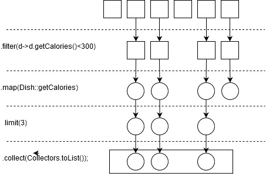

# 引入流

## 什么是流

1. 什么是流
声明性方式处理数据集合

+ 对比传统和stream的集合处理方式

```java
List<Dish> lowCaloricDishes = new ArrayList<>();
List<Dish> menu = StreamDemoUtil.genDishList();
for(Dish d:menu) {
    if(d.getCalories()<300) {
        lowCaloricDishes.add(d);
    }
}
Collections.sort(lowCaloricDishes,new Comparator<Dish>(){
    @Override
    public int compare(Dish o1, Dish o2) {
        return Integer.compare(o1.getCalories(), o2.getCalories());
    }

});
List<Integer> lowCaloricDishesName = new ArrayList<>();
for(Dish d:lowCaloricDishes){
    lowCaloricDishesName.add(d.getCalories());
}
System.out.println(lowCaloricDishesName);

//使用流处理数据
List<Integer> lowCaloricDishesName = StreamDemoUtil.genDishList().stream()
    .filter(d->d.getCalories()<300)
    .sorted(Comparator.comparingInt(Dish::getCalories))
    .map(Dish::getCalories)
    .collect(Collectors.toList());
System.out.println(lowCaloricDishesName);
```

+ 代码是声明性的，只要说明需要完成什么,过滤，排序，映射常规操作
由JDK完成，开发者需要用Lambda来组织
+ 基础操作链式.filter->sorted->map等等

2. 流简介

Java8的集合支持一个新的stream方法，它会返回一个流，数值范围，或者从I/O资源生成流元素。**从支持数据处理操作的源生成的元素序列**

关键字：
元素序列:可以访问特定元素
源:流会使用一个提供数据的源，有序集合生成流会保留顺序
数据处理操作:filter，map,reduce等等

关键特点：
流水线:流的操作会返回一个流，形成链接操作
内部迭代：和迭代器不同，流的迭代操作时在背后进行


## 集合与流

1. 集合与流的差异在什么时候计算，集合的每个元素都得先算出来才能添加到集合中，而流是固定的数据结构，不能添加和删除，元素是**按需计算**
2. 集合与流只能遍历一次
3. 集合需要用户去做迭代(for-each),流使用内部迭代
4. Stream接口定义了许多操作，分为两大类中间操作和终端操作，中间操作返回另一个流对象来触发链式,终端操作从流的流水线生成结果

```java
List<Integer> lowCaloricDishesName = StreamDemoUtil.genDishList().stream()
    .filter(d->d.getCalories()<300)
    .limit(3)
    .map(Dish::getCalories)
    .collect(Collectors.toList());
```

filter，limit，map是中间操作，collect是终端操作
stream使用了循环合并在后台将filter和map操作写在一起，limit是一种短路技巧

5. 流的使用包括了一个数据源，一个中间操作链和终端操作
